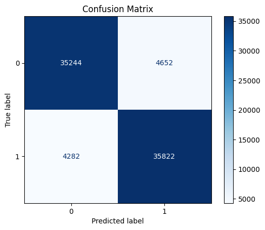
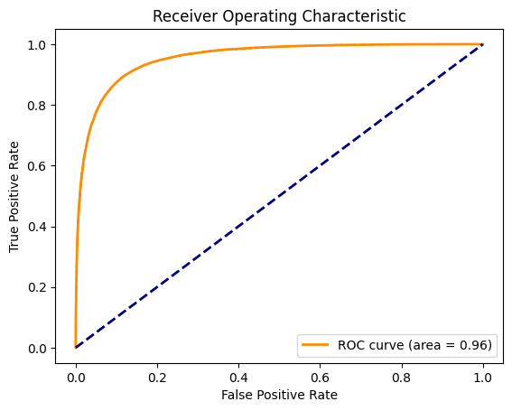

markdown
# Amazon Review Sentiment Classifier

This project uses machine learning to classify Amazon product reviews as Positive or Negative based on the review text. It includes data preprocessing, model training, evaluation, and a Streamlit web app for interactive predictions.

## Objective

Build a sentiment classifier that analyzes Amazon product reviews and predicts whether the sentiment is positive or negative.

## Dataset

This project uses the [Amazon Product Reviews dataset](https://www.kaggle.com/datasets/datafiniti/amazon-product-reviews) from Kaggle. It contains thousands of product reviews with associated metadata such as star ratings and review text.

- Source: Kaggle
- Type: Text + Ratings
- Size: ~100,000 reviews
- Use Case: Sentiment classification based on review text

## Project Structure

```
amazon-review-classifier/
├── amazon_review_classifier.ipynb       # Main notebook for data processing and modeling
├── app.py                               # Streamlit app for sentiment prediction
├── sentiment_model.pkl                  # Trained Logistic Regression model
├── tfidf_vectorizer.pkl                 # TF-IDF vectorizer used for feature extraction
├── images/                              # Visualizations (confusion matrix, ROC curve, etc.)
├── README.md                            # Project documentation
```

## Key Steps

### 1. Data Preprocessing
- Lowercasing, punctuation removal
- Stopword filtering
- TF-IDF vectorization

### 2. Modeling
- Logistic Regression classifier
- Evaluation using accuracy, precision, recall, F1-score

### 3. Visualization
- Confusion matrix
- ROC curve (AUC = 0.96)

### 4. Deployment
- Streamlit app for real-time sentiment prediction

## Model Evaluation

### Confusion Matrix



- True Positives: 35,822
- True Negatives: 35,244
- False Positives: 4,652
- False Negatives: 4,282

### ROC Curve



- ROC AUC: 0.96
- Accuracy: ~89.3%

## How to Run

1. Clone the repository:
   ```bash
   git clone https://github.com/Coder7867/Amazon-Review-Sentiment-Classifier.git
   cd Amazon-Review-Sentiment-Classifier
   ```

2. Install dependencies:
   ```bash
   pip install -r requirements.txt
   ```

3. Run the app:
   ```bash
   streamlit run app.py
   ```

*Bonus Ideas*

- Try deep learning models like LSTM or BERT
- Add multi-class classification (e.g., 1–5 star prediction)
- Compare sentiment across product categories

*License*

This project is licensed under the MIT License.
